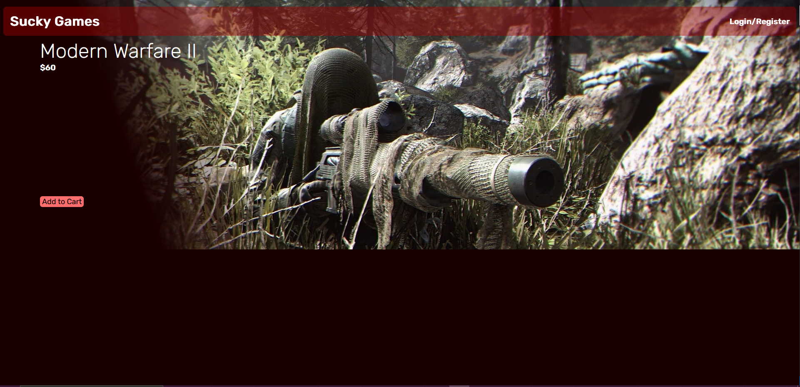

# SuckyGames

The purpose of this web app is to serve as an online store for users to browse a collection of the company's aquired games.

This react app is created without using the create-react-app command to better understand how react works and to control what gets downloaded into my web application.

# Preview
